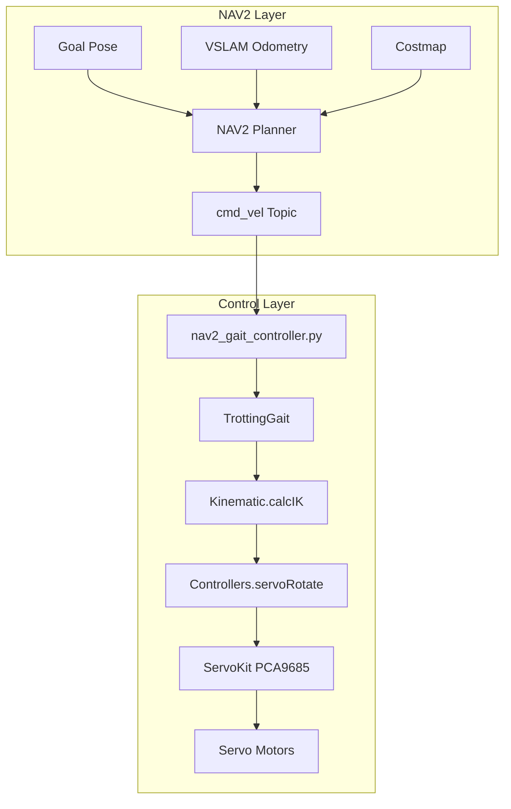
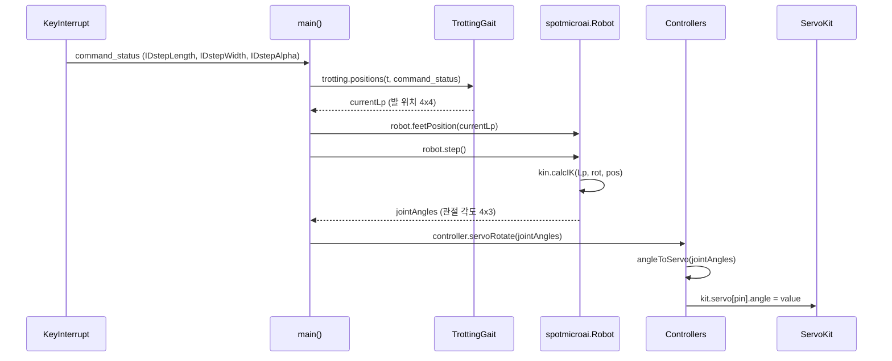

# IK Control Workflow - NAV2 기반 역기구학 제어

## 개요

기존 VSLAM + NAV2로부터 `cmd_vel`(속도 명령)을 수신하여, hardcoding 폴더의 역기구학 기반으로 SpotMicro 로봇을 제어하는 워크플로우입니다.

---

## 시스템 아키텍처



---

## 코드 간 Interaction

### 현재 코드 흐름 (start_automatic_gait.py 기준)



### 핵심 데이터 흐름

| 단계 | 입력 | 처리 | 출력 | 담당 파일 |
|------|------|------|------|-----------|
| 1 | `cmd_vel` (vx, vy, wz) | NAV2 → Gait 파라미터 변환 | `IDstepLength`, `IDstepWidth`, `IDstepAlpha` | **[신규]** `nav2_gait_controller.py` |
| 2 | Gait 파라미터 + 시간 | `TrottingGait.positions()` | 발 위치 `Lp` (4×4 배열) | `kinematicMotion.py` |
| 3 | 발 위치 + Body 자세 | `Kinematic.calcIK()` | 관절 각도 `La` (4×3 배열) | `kinematics.py` |
| 4 | 관절 각도 (rad) | `Controllers.angleToServo()` | 서보 각도 (deg) | `servo_controller.py` |
| 5 | 서보 각도 | `ServoKit.servo[pin].angle` | PWM 출력 | `adafruit_servokit` |

---

## 구현 필요 사항

### 1. [신규] nav2_gait_controller.py

> 위치: `scripts/hardcoding/nav2_gait_controller.py`

NAV2 `/cmd_vel` 토픽을 구독하여 TrottingGait 파라미터로 변환하는 ROS2 노드

```python
#!/usr/bin/env python3
"""
NAV2 cmd_vel → TrottingGait 제어기
"""
import rclpy
from rclpy.node import Node
from geometry_msgs.msg import Twist
import numpy as np
import time

from Kinematics.kinematicMotion import TrottingGait
from Kinematics.kinematics import Kinematic
import servo_controller

class NAV2GaitController(Node):
    def __init__(self):
        super().__init__('nav2_gait_controller')
        
        # ROS2 구독
        self.cmd_vel_sub = self.create_subscription(
            Twist, '/cmd_vel', self.cmd_vel_callback, 10)
        
        # 제어 파라미터
        self.gait = TrottingGait()
        self.kin = Kinematic()
        self.controller = servo_controller.Controllers()
        
        # cmd_vel → Gait 변환 게인
        self.VX_TO_STEP_LENGTH = 50.0   # m/s → mm
        self.VY_TO_STEP_WIDTH = 30.0    # m/s → mm
        self.WZ_TO_STEP_ALPHA = 20.0    # rad/s → deg
        
        # 초기 발 위치
        self.Lp = np.array([
            [120, -100, 87.5, 1],
            [120, -100, -87.5, 1],
            [-50, -100, 87.5, 1],
            [-50, -100, -87.5, 1]
        ])
        
        # 상태
        self.cmd_vel = {'IDstepLength': 0.0, 'IDstepWidth': 0.0, 'IDstepAlpha': 0.0}
        self.is_moving = False
        self.start_time = time.time()
        
        # 제어 루프 타이머 (30Hz)
        self.timer = self.create_timer(0.033, self.control_loop)
        
    def cmd_vel_callback(self, msg: Twist):
        """NAV2 cmd_vel → Gait 파라미터 변환"""
        self.cmd_vel['IDstepLength'] = msg.linear.x * self.VX_TO_STEP_LENGTH
        self.cmd_vel['IDstepWidth'] = msg.linear.y * self.VY_TO_STEP_WIDTH
        self.cmd_vel['IDstepAlpha'] = msg.angular.z * self.WZ_TO_STEP_ALPHA
        
        # 이동 여부 판단
        self.is_moving = (abs(msg.linear.x) > 0.01 or 
                          abs(msg.linear.y) > 0.01 or 
                          abs(msg.angular.z) > 0.01)
    
    def control_loop(self):
        """메인 제어 루프"""
        t = time.time() - self.start_time
        
        # 발 위치 계산
        if self.is_moving:
            currentLp = self.gait.positions(t, self.cmd_vel)
        else:
            currentLp = self.Lp
        
        # 역기구학 → 관절 각도
        joint_angles = self.kin.calcIK(currentLp, (0, 0, 0), (0, 40, 0))
        
        # 서보 구동
        self.controller.servoRotate(joint_angles)

def main():
    rclpy.init()
    node = NAV2GaitController()
    rclpy.spin(node)
    node.destroy_node()
    rclpy.shutdown()

if __name__ == '__main__':
    main()
```

---

### 2. [수정] kinematicMotion.py

> 기존 `TrottingGait.positions()` 메서드는 이미 `kb_offset` 딕셔너리를 받아 처리함

#### 현재 코드 (Line 128-155)

```python
def positions(self,t,kb_offset={}):
    if list(kb_offset.values()) == [0.0, 0.0, 0.0]:
        self.Sl=0.0  # stepLength
        self.Sw=0.0  # stepWidth
        self.Sa=0.0  # stepAlpha
    else:
        self.Sl=kb_offset['IDstepLength']
        self.Sw=kb_offset['IDstepWidth']
        self.Sa=kb_offset['IDstepAlpha']
```

#### 수정 사항

`StartStepping` 키 제거 필요 (NAV2에서는 사용 안 함)

```diff
 def positions(self,t,kb_offset={}):
-    if list(kb_offset.values()) == [0.0, 0.0, 0.0]:
+    # NAV2 cmd_vel 호환: 3개 키만 체크
+    if (kb_offset.get('IDstepLength', 0.0) == 0.0 and
+        kb_offset.get('IDstepWidth', 0.0) == 0.0 and
+        kb_offset.get('IDstepAlpha', 0.0) == 0.0):
         self.Sl=0.0
         self.Sw=0.0
         self.Sa=0.0
     else:
         self.Sl=kb_offset['IDstepLength']
         self.Sw=kb_offset['IDstepWidth']
         self.Sa=kb_offset['IDstepAlpha']
```

---

### 3. [수정] servo_controller.py

> **핵심 수정 사항**: `config.py`를 Single Source of Truth로 사용해야 함.
> 기존의 하드코딩된 `_servo_offsets`, `_val_list`, I2C 주소 등을 모두 제거하고 `config.PIN_MAP` 데이터를 활용하여 제어하도록 리팩토링.

#### 수정 전 코드 문제점

```python
# 하드코딩된 파라미터들 (config.py와 충돌)
self._servo_offsets = [170, 85, 90, 1, 95, 90, 172, 90, 90, 1, 90, 95]
self._kit = ServoKit(channels=16, i2c=self._i2c_bus0, address=0x40)
```

#### 수정 가이드 (Refactoring)

`config.py`의 구조(`PIN_MAP`, `dirs`, `offset`)를 그대로 사용하여 관절 각도를 서보 펄스로 변환하는 로직 구현.

```python
import config as cfg
import math

class Controllers:
    def __init__(self):
        print("Initializing Servos with config.py")
        self._i2c_bus0 = busio.I2C(board.SCL_1, board.SDA_1)
        
        # config.py에서 주소 가져오기
        self._kit_front = ServoKit(channels=16, i2c=self._i2c_bus0, address=cfg.PCA_ADDR_FRONT)
        self._kit_rear = ServoKit(channels=16, i2c=self._i2c_bus0, address=cfg.PCA_ADDR_REAR)
        
        # 다리 순서 정의 (Kinematics 출력 순서와 일치: FL, FR, RL, RR)
        self.leg_keys = ['front-left', 'front-right', 'rear-left', 'rear-right']

    def servoRotate(self, joint_angles_rad):
        """
        joint_angles_rad: 4x3 numpy array (Radian)
        [[FL_hip, FL_upper, FL_lower], [FR...], [RL...], [RR...]]
        """
        
        for leg_idx, leg_key in enumerate(self.leg_keys):
            leg_cfg = cfg.PIN_MAP[leg_key]
            kit_type = leg_cfg['kit']       # 'front' or 'rear'
            target_kit = self._kit_front if kit_type == 'front' else self._kit_rear
            
            # 3개 관절 (Shoulder, Leg, Foot) 반복
            for joint_idx in range(3):
                # 1. 입력 각도 (Rad) → 각도 (Deg)
                angle_deg = math.degrees(joint_angles_rad[leg_idx][joint_idx])
                
                # 2. config.py 설정 적용
                # 공식: Target = 90 + dir * (angle + offset)
                direction = leg_cfg['dirs'][joint_idx]
                offset = leg_cfg['offset'][joint_idx]
                
                target_val = 90.0 + direction * (angle_deg + offset)
                
                # 3. 안전 범위 클리핑 (config.py의 SERVO_SAFE_MIN/MAX 활용 권장)
                target_val = max(cfg.SERVO_SAFE_MIN, min(cfg.SERVO_SAFE_MAX, target_val))
                
                # 4. 서보 구동
                pin = leg_cfg['pins'][joint_idx]
                target_kit.servo[pin].angle = target_val
```

---

### 4. [수정] config.py

> 현재 상태: 최신 하드웨어 설정 반영됨 ✅

추가 수정 불필요. 단, `servo_controller.py`에서 이 설정을 가져와 사용해야 함.

---

## 파일별 수정 요약

| 파일 | 작업 | 우선순위 |
|------|------|----------|
| `nav2_gait_controller.py` | **신규 생성** - NAV2 인터페이스 | 🔴 High |
| `kinematicMotion.py` | 수정 - `positions()` 호환성 개선 | 🟡 Medium |
| `servo_controller.py` | 수정 - `config.py` 연동 | 🟡 Medium |
| `config.py` | 수정 불필요 | ✅ Done |
| `kinematics.py` | 수정 불필요 | ✅ Done |

---

## 검증 계획

### 단계별 테스트

| 단계 | 테스트 방법 | 성공 기준 |
|------|-------------|-----------|
| 1 | `ros2 topic echo /cmd_vel` | NAV2 명령 수신 확인 |
| 2 | Gait 파라미터 로깅 | `IDstepLength` 값 정상 변환 |
| 3 | 역기구학 출력 확인 | 관절 각도 범위 내 (-π ~ π) |
| 4 | 공중 테스트 | 로봇 다리 움직임 확인 |
| 5 | 바닥 테스트 | Goal 방향 이동 확인 |

### 테스트 명령어

```bash
# 1. NAV2 cmd_vel 수동 퍼블리시 (테스트용)
ros2 topic pub /cmd_vel geometry_msgs/Twist \
  "{linear: {x: 0.1, y: 0.0, z: 0.0}, angular: {x: 0.0, y: 0.0, z: 0.0}}"

# 2. 컨트롤러 실행
cd /home/actuating/workspaces/spotmicro/scripts/hardcoding
python3 nav2_gait_controller.py
```

---

## 참고 사항

### cmd_vel 변환 게인 튜닝

| 파라미터 | 초기값 | 설명 |
|----------|--------|------|
| `VX_TO_STEP_LENGTH` | 50.0 | 전진 속도 → 보폭 |
| `VY_TO_STEP_WIDTH` | 30.0 | 측면 속도 → 측면 이동폭 |
| `WZ_TO_STEP_ALPHA` | 20.0 | 회전 속도 → 회전각 |

> ⚠️ 실제 로봇에서 튜닝 필요

### 참고 자료

- [NAV2 Documentation](https://nav2.org/)
- [geometry_msgs/Twist](http://docs.ros.org/en/noetic/api/geometry_msgs/html/msg/Twist.html)