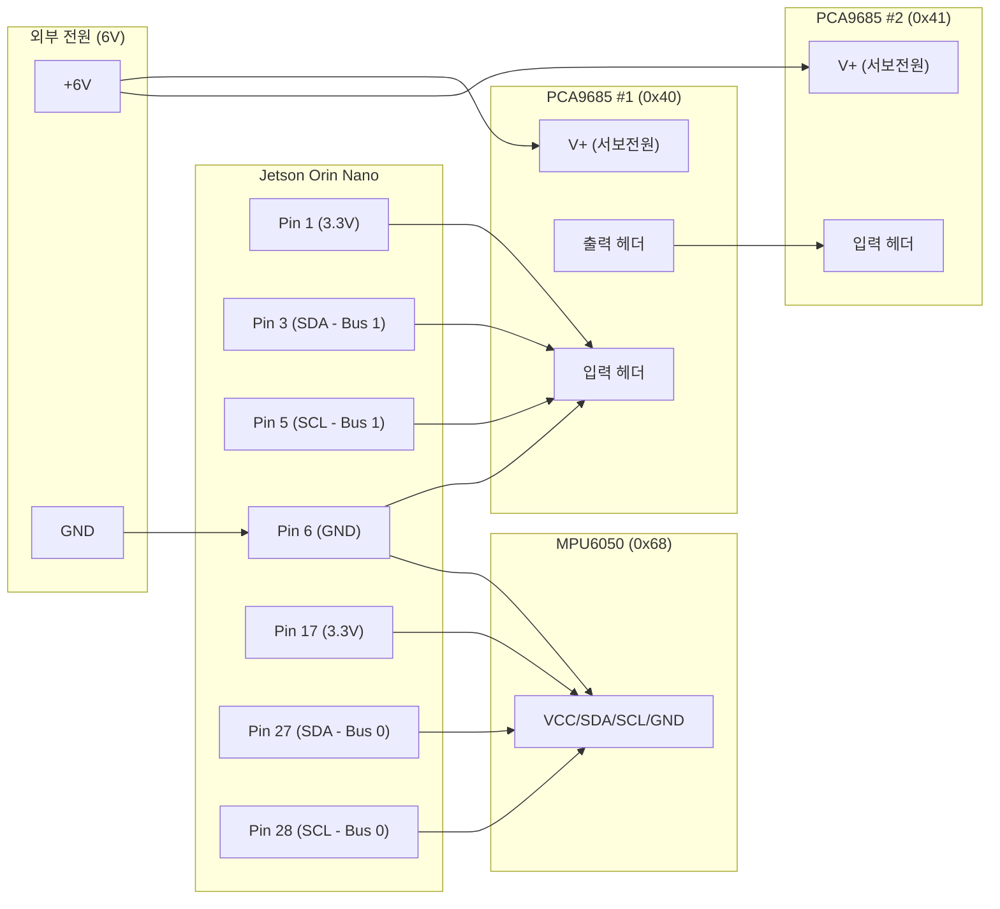

# Validity
> 데이터 시트 기반으로, 로봇의 구동에 무리가 없을 지 판단한다.
## 1. Battery
## Connected devices
> 배터리는 아래 장치들에 전력을 공급한다.
- jetson orin nano
- sensors: HC-SR04, MPU-6050, PCA9685
- DS3218MG pro * 12
- Orbbec Astra Pro 3D 카메라

| 구분        | 요구사항                                                                                    |
| --------- | --------------------------------------------------------------------------------------- |
| 전압        | 배터리(예: 2S~3S LiPo)를 DC-DC로 분리해 서보 레일 6V, Jetson/센서/카메라 5V 안정화                           |
| 전류 - 서보   | DS3218MG pro 12개 스톨 가정 2~2.5A/ea -> 피크 약 24~30A @6V. 서보용 벅컨 연속 15A+, 피크 30A+ 권장         |
| 전류 - 시스템  | Jetson Orin Nano + Orbbec Astra Pro + 센서: 약 20~25W -> 5V 기준 4~5A (배터리 측 3S 기준 약 2~2.5A) |
| 전류 - 총 피크 | 서보 30A + 논서보 여유 3A -> 순간 33A 이상 공급 가능한 배터리/배선/BMS 필요                                    |
| 배터리 연속 방전 | 서보 평균 0.5A/ea 가정 시 6A + 시스템 3A ~ 9A -> 여유 포함 15A급 이상 권장                                 |
| 배터리 피크 방전 | 33A 이상 (3S 5600mAh 100C는 여유 충분, 병목은 DC-DC·커넥터·배선)                                       |
| BMS 조건    | 차단 전류가 피크보다 높고, 저전압 컷오프가 2S/3S에 맞는 팩 사용할 것                                              |
| 예상 구동 시간  | 3S 5600mAh(약 62Wh) 기준, 평균 10A@11.1V 소비 시 `t ~ 0.56h`(약 34분). 부하 증가 시 비례 단축              |


## 2. Isaac Sim Simulation Parameters & Hardware Validity Analysis

## 3. Enhance camera mount
기존 카메라 마운트가 나사 1개로 지지되어 회전에 취약한 점을 해결하기 위해, 좌우 지지하는 마운트를 모델링 후 3D프린팅하여 보강.

## 4. TroubleShooting
### 어깨 관절 보강하기
> 어깨 관절에서, 다리 전체가 `서보 모터 혼`에 의해서만 지지되어 불안정한 문제를 해결하기 위한 방법이다.

### 모터드라이버, 스텝다운 모듈 전원 공급선 쇼트 발생
글루건 작업으로 해결

# 참고자료
## datasheets
- Jetson Orin Nano Developer Kit: https://d29g4g2dyqv443.cloudfront.net/sites/default/files/Jetson_Orin_Nano_Developer_Kit_RG_0.pdf
- HC-SR04 초음파 센서: https://cdn.sparkfun.com/datasheets/Sensors/Proximity/HCSR04.pdf
- MPU-6050 IMU: https://invensense.tdk.com/wp-content/uploads/2015/02/MPU-6000-Datasheet1.pdf
- Rocker 스위치 RL2-321: https://www.edcon-components.com/Webside/PDFEA/RL2_3.pdf
- XL4016 DC-DC 컨버터: https://datasheet.lcsc.com/szlcsc/1811021511_XI-LAN-DCSHANGHAI-XI-LIAN-XL4016_C105450.pdf
- LM2596 DC-DC 컨버터: https://www.ti.com/lit/ds/symlink/lm2596.pdf
- PCA9685 PWM 서보 드라이버: https://cdn-shop.adafruit.com/datasheets/PCA9685.pdf
- DS3218MG 서보 모터: https://www.dsservo.com/d_file/DS3218%20datasheet.pdf
- Orbbec Astra Pro 3D 카메라: https://www.mybotshop.de/Datasheet/Orbbec_Astra_Pro_Final.pdf
- 커넥터류, 점퍼케이블, 수축튜브는 충민이 꺼 사용
- 서포트는 SSAFY 제공 키트에 포함

# Electronics
전원 및 신호선 배선은 아래와 같다.
컴퓨터: Jetson orin nano developer kit
- PCA9685: 2개
- MPU6050: 1개

## I2C 디바이스 연결 계획

Jetson Orin Nano Developer Kit에 PCA9685 PWM 서보 드라이버 2개와 MPU6050 IMU 센서 1개를 I2C 통신으로 연결하는 계획입니다.

### 하드웨어 구성 요약

| 디바이스 | 수량 | 기본 I2C 주소 | 용도 |
|---------|------|--------------|------|
| PCA9685 | 2개 | 0x40, 0x41 | 12개의 서보 모터 제어 (각 보드 6개씩) |
| MPU6050 | 1개 | 0x68 | IMU 센서 (가속도계/자이로) |

### 1. 하드웨어 연결 준비

#### 필요 부품
- 점퍼 케이블 (Female-Female 또는 Female-Male)
- 외부 전원 공급 장치 (서보용, 6V 권장)

> [!CAUTION]
> 모든 배선 작업은 **Jetson Orin Nano의 전원을 완전히 끈 상태**에서 수행해야 합니다.

### 2. Jetson Orin Nano GPIO 핀아웃

40핀 헤더의 I2C 핀 구성:

| 버스 | SDA 핀 | SCL 핀 | 권장 용도 |
|-----|--------|--------|----------|
| I2C Bus 1 (또는 7) | Pin 3 | Pin 5 | PCA9685 #1, #2 (데이지 체인) |
| I2C Bus 0 | Pin 27 | Pin 28 | MPU6050 (독립 연결) |

**전원 핀:**
- 3.3V: Pin 1, Pin 17
- GND: Pin 6, Pin 9, Pin 14, Pin 20, Pin 25

### 3. PCA9685 I2C 주소 설정 ✅

> [!NOTE]
> **이미 완료됨**: PCA9685 #1(0x40), #2(0x41) 주소 납땜 완료

| 보드 | I2C 주소 | 제어할 서보 |
|-----|---------|------------|
| PCA9685 #1 | **0x40** | FL, FR 다리 (6개) |
| PCA9685 #2 | **0x41** | RL, RR 다리 (6개) |

### 4. 배선 다이어그램 (MPU6050 독립 연결)

**PCA9685**는 데이지 체인 연결, **MPU6050**은 별도 I2C 버스에 직접 연결합니다.



#### 배선 상세표

| 연결 대상 | Jetson 핀 | 설명 |
|----------|----------|------|
| **PCA9685 #1** | Pin 1(3.3V), Pin 3(SDA), Pin 5(SCL), Pin 6(GND) | I2C Bus 1 |
| **PCA9685 #2** | PCA9685 #1 출력 헤더에서 데이지 체인 | I2C Bus 1 |
| **MPU6050** | Pin 17(3.3V), Pin 27(SDA), Pin 28(SCL), Pin 6(GND) | I2C Bus 0 (독립) |
| **서보 전원** | 외부 6V → PCA9685 #1, #2의 V+ | 공통 GND 필수 |

#### MPU6050 독립 연결 장점
- **노이즈 격리**: 서보 PWM 신호와 분리하여 IMU 데이터 정확도 향상
- **버스 부하 분산**: 각 I2C 버스의 통신 부하 감소
- **독립적 제어**: 서보 제어와 IMU 읽기를 병렬 처리 가능

> [!WARNING]
> **서보 전원(V+)은 반드시 외부 6V 전원을 사용해야 합니다!** Jetson 핀으로 서보를 구동하면 보드가 손상됩니다.

### 5. 소프트웨어 검증

#### I2C 장치 검출 테스트

연결 후 Jetson Orin Nano에서 다음 명령어로 장치 인식을 확인합니다:

```bash
# I2C 버스 목록 확인
ls /dev/i2c-*

# I2C 버스 1에서 장치 스캔 (PCA9685)
sudo i2cdetect -r -y 1

# I2C 버스 0에서 장치 스캔 (MPU6050)
sudo i2cdetect -r -y 0
```

#### 예상 출력 (Bus 1)
```
     0  1  2  3  4  5  6  7  8  9  a  b  c  d  e  f
40: 40 41 -- -- -- -- -- -- -- -- -- -- -- -- -- -- 
```

#### 예상 출력 (Bus 0)
```
     0  1  2  3  4  5  6  7  8  9  a  b  c  d  e  f
60: -- -- -- -- -- -- -- -- 68 -- -- -- -- -- -- -- 
```

### 6. Python 가상환경 및 라이브러리 설치

#### 가상환경 생성 및 활성화

```bash
# 프로젝트 디렉토리로 이동
cd ~/spotmicro

# 가상환경 생성
python3 -m venv venv

# 가상환경 활성화
source venv/bin/activate

# pip 업그레이드
pip install --upgrade pip
```

#### 필요한 라이브러리 설치

```bash
# I2C 기본 도구
pip install smbus2

# Adafruit PCA9685 라이브러리
pip install adafruit-circuitpython-pca9685

# MPU6050 라이브러리
pip install mpu6050-raspberrypi

# (선택) Jetson GPIO 라이브러리
pip install Jetson.GPIO
```

#### requirements.txt 생성

```bash
pip freeze > requirements.txt
```

> [!TIP]
> 다음 세션에서는 `source venv/bin/activate`로 가상환경을 활성화한 후 작업하세요.

### 작업 순서 체크리스트

- [ ] Jetson Orin Nano 전원 끄기
- [x] PCA9685 #1, #2 I2C 주소 납땜 (0x40, 0x41) ✅
- [ ] PCA9685 데이지 체인 배선 (Bus 1: Pin 3, 5)
- [ ] MPU6050 독립 연결 (Bus 0: Pin 27, 28)
- [ ] 서보용 외부 전원(6V) 연결 및 공통 GND 연결
- [ ] Jetson 전원 켜기 및 `i2cdetect`로 장치 확인
- [ ] Python 가상환경 생성 및 라이브러리 설치
- [ ] 테스트 코드 실행