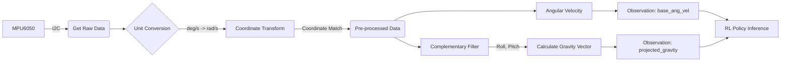

현재 파일(

flat_env_recent.py
)에 설정된 50Hz 시뮬레이션 환경에 실제 로봇을 맞추기 위한 값입니다.

시뮬레이션 코드가 decimation = 4 (50Hz)로 설정되어 있으므로, 실제 로봇 센서도 50Hz로 데이터를 뽑아야 1:1 매칭이 됩니다.

1. SMPLRT_DIV (샘플 레이트 분주비)
추천 값: 19 (0x13)
이유:
현재 시뮬레이션 제어 주기: $0.005s \times 4 = 0.02s$ (50 Hz)
목표: Real Robot도 50 Hz로 설정
계산: $50 Hz = \frac{1000 Hz}{1 + SMPLRT_DIV} \rightarrow SMPLRT_DIV = 19$
2. DLPF_CFG (디지털 로우패스 필터)
추천 값: 4 (21Hz 대역폭) 또는 3 (44Hz 대역폭)
이유:
제어 주기가 50Hz로 느려졌으므로, 필터 대역폭도 더 낮춰야 앨리어싱(Aliasing)을 막을 수 있습니다.
설정 4 (21Hz): 50Hz 샘플링에 가장 적합한 필터 (Nyquist Frequency 25Hz 이하). 데이터가 매우 부드럽고 안정적이지만 지연 시간(8.5ms)이 조금 있습니다.
설정 3 (44Hz): 반응은 더 빠르지만(4.9ms), 50Hz 주기에서는 노이즈가 튈 수 있습니다.
3. 요약 (제안)
안정적인 심-리얼(Sim-to-Real) 매칭을 원하신다면 아래 조합을 추천합니다.

설정 항목	값 (10진수)	값 (16진수)	설명
SMPLRT_DIV	19	0x13	50 Hz 출력 (Sim 제어 주기와 일치)
DLPF_CFG	4	0x04	21 Hz 필터 (느린 주기에 맞춰 노이즈 제거 강화)

isaac sim gui에서는 값을 다음과 같이 수정하면 된다.
1. Angular Velocity Filter Width (Gyro Bandwidth)
값: 42 Hz
설명: DLPF_CFG=3일 때 자이로스코프의 대역폭은 42Hz가 되며, 지연 시간(Delay)은 약 4.8ms입니다.
2. Linear Acceleration Filter Width (Accel Bandwidth)
값: 44 Hz
설명: DLPF_CFG=3일 때 가속도계의 대역폭은 44Hz가 되며, 지연 시간(Delay)은 약 4.9ms입니다.
3. Sensor Period (Sample Period)
값: 0.01 seconds (10ms)
계산 과정:
DLPF가 켜져 있으므로(3), 내부 Gyro Rate는 **1kHz (1000Hz)**가 됩니다.
Sample Rate = $1000 / (1 + 9) = 100Hz$
Period = $1 / 100Hz = 0.01s$
요약 (Isaac Sim 등의 Config 입력용)
angular_velocity_filter_width: 42
linear_acceleration_filter_width: 44
sensor_period: 0.01

# IMU Calibration
> [!info] 프롬프트
> 상황 설명
> IsaacLab으로 학습한 모델을 Jetson orin nano에 올려서, 그 모델을 바탕으로 4족보행 로봇을 움직인다.
> 학습 코드는 flat_env_cfg_250205.py를 기반으로 한다.
> 
> 위의 환경 기준으로 실제 로봇의 IMU Sensor로부터 받아온 값을 모델에 적합하게 전달하고자 한다. 이를 위한 계획을 작성하라

---

# Sim2Real IMU 데이터 통합 가이드 (Technical Report)

본 보고서는 **Isaac Lab**에서 학습한 4족 보행 로봇 모델(`flat_env_cfg_250205.py`)을 **Jetson Orin Nano** 및 **MPU6050** 기반의 실제 로봇(Real Robot)에 배포하기 위한 IMU 데이터 처리 절차를 기술합니다.

기존 코드(`controlled_by_model.py`)에 의존하지 않고, **좌표계 정의**, **단위 변환**, **데이터 가공**의 원리적인 접근 방식을 다룹니다.

---

## 1. 좌표계 정의 및 변환 (Coordinate Systems)

Sim2Real의 가장 핵심적인 단계는 시뮬레이션 환경과 실제 하드웨어 간의 **좌표계 일치(Alignment)**입니다.

### 1.1 Isaac Lab (Simulation) 좌표계
Isaac Lab(USD/PhysX)은 일반적으로 **ENU (East-North-Up)** 또는 **Right-Handed Z-up** 좌표계를 사용합니다.
- **X축**: 로봇의 **전방(Front)**
- **Y축**: 로봇의 **좌측(Left)**
- **Z축**: 로봇의 **상단(Up)**
- **회전 방향**: 오른손 법칙(Right-Hand Rule)을 따름

### 1.2 MPU6050 (Real World) 좌표계
센서의 부착 방향에 따라 다르지만, 일반적으로 칩 표면에 축 방향이 인쇄되어 있습니다.
만약 `hardware_config.py`의 주석에 명시된 대로 실제 로봇이 다음을 따른다면:
- **X축**: 전방 (Front)
- **Y축**: 우측 (Right)
- **Z축**: 하단 (Down)

이는 **NED (North-East-Down)** 계열의 좌표계이며, Isaac Lab 좌표계와 **Y, Z축이 반대**입니다.

### 1.3 좌표 변환 행렬 (Transformation Matrix)
센서 데이터($v_{raw}$)를 시뮬레이션 프레임($v_{sim}$)으로 변환하기 위한 변환 규칙은 다음과 같습니다.

$$
\begin{bmatrix} x_{sim} \\ y_{sim} \\ z_{sim} \end{bmatrix} = \begin{bmatrix} 1 & 0 & 0 \\ 0 & -1 & 0 \\ 0 & 0 & -1 \end{bmatrix} \begin{bmatrix} x_{raw} \\ y_{raw} \\ z_{raw} \end{bmatrix}
$$

- **X축**: 그대로 사용
- **Y축**: 부호 반전 (Left <-> Right)
- **Z축**: 부호 반전 (Up <-> Down)


---

### 1.4 좌표계 매칭의 일반 원리 (Generalized 3-Step Rule)

특정 센서나 좌표계 용어(ENU, NED)에 구애받지 않고, **어떤 로봇과 센서 조합에도 적용할 수 있는 불변의 법칙**입니다.

1.  **목표(Target) 좌표계 정의**: 시뮬레이터(Isaac Lab)가 정의하는 **로봇 몸체 기준(Body Frame)**의 앞($+X$), 왼쪽($+Y$), 위($+Z$) 방향을 확인합니다.
    *   *왼쪽의 정의: 로봇의 뒤에서 앞을 바라보았을 때(운전자 시점)의 왼쪽을 의미합니다.*
2.  **실제(Source) 좌표계 확인**: 실제 센서가 부착된 모양을 보고, 센서의 $x, y, z$ 화살표가 로봇의 어느 쪽을 가리키는지 봅니다.
3.  **축 매핑(Mapping)** 및 **검증(Test)**:
    *   **중력 테스트**: 센서를 가만히 두었을 때 $-9.8$ (중력가속도)이 찍히는 축을 찾아 시뮬레이션의 바닥 방향($-Z$)과 **연결**합니다.
        *   *예시: 만약 센서의 $y$축이 -9.8을 가리킨다면? $\rightarrow$ $Z_{sim} = y_{raw}$*
        *   *예시: 만약 센서의 $y$축이 +9.8을 가리킨다면? $\rightarrow$ $Z_{sim} = -y_{raw}$ (부호 반전)*
    *   **밀기 테스트**: 로봇을 앞으로 밀었을 때 양수(+)가 나오는 축을 시뮬레이션의 전진 방향($+X$)과 **연결**합니다.
        *   *예시: 앞으로 밀었는데 센서 $x$축 값이 감소한다면? $\rightarrow$ $X_{sim} = -x_{raw}$*
    *   **Y축 결정 (오른손 법칙)**: 위에서 구한 $Z$(위)와 $X$(앞)를 기준으로 $Y$(왼쪽)를 수학적으로 계산합니다.
        *   **손가락 요령**: 오른손의 **엄지($Z$, 위)**와 **검지($X$, 앞)**를 폈을 때, **중지가 가리키는 방향이 $Y$(왼쪽)**가 됩니다.
        *   $Z$와 $X$ 축의 부호가 결정되었다면, $Y$축은 남은 하나의 축에 부호만 맞춰주면 됩니다.

> **"일치시킨다"는 의미**: 1) 어떤 센서 축 데이터를 가져올지 결정하고(매핑), 2) 방향이 반대라면 마이너스($-$)를 붙여주는 것(부호 보정)을 말합니다.


> 	**"일치시킨다"는 의미**: 1) 어떤 센서 축 데이터를 가져올지 결정하고(매핑), 2) 방향이 반대라면 마이너스($-$)를 붙여주는 것(부호 보정)을 말합니다.`

**일반화 공식 (행렬 표현):**

$$
\begin{bmatrix}
\text{Target}_{X} \\
\text{Target}_{Y} \\
\text{Target}_{Z}
\end{bmatrix}
=
\mathbf{R}_{adjust}
\begin{bmatrix}
\text{Source}_{x} \\
\text{Source}_{y} \\
\text{Source}_{z}
\end{bmatrix}
$$

여기서 $\mathbf{R}_{adjust}$는 각 행과 열에 $\pm 1$이 정확히 하나씩만 존재하는 **치환 행렬(Permutation Matrix)** 형태가 됩니다.

$$
\mathbf{R}_{adjust} =
\begin{bmatrix}
0 & 0 & 1 \\
-1 & 0 & 0 \\
0 & -1 & 0
\end{bmatrix}
\quad
(\text{예시: } X \leftarrow Z, \ Y \leftarrow -X, \ Z \leftarrow -Y)
$$

---
## 2. 관측 데이터 생성 절차 (Observation Generation)

학습 설정(`flat_env_cfg_250205.py`)에서 요구하는 IMU 관련 관측값은 다음과 같습니다.

1.  **`base_ang_vel`** (Base Angular Velocity): 몸통 각속도
2.  **`projected_gravity`**: 몸통 좌표계로 투영된 중력 벡터

### 2.1 `base_ang_vel` (각속도) 처리
MPU6050의 **Gyroscope** Raw 데이터(16-bit 정수)를 물리 단위(rad/s)로 바로 변환합니다.

**처리 단계:**

1.  **Raw Data Read**: I2C로 자이로 레지스터 값을 읽어옵니다. (16-bit signed int, Range: -32768 ~ 32767)
2.  **Raw $\rightarrow$ Rad/s 변환**: **감도(Sensitivity)**로 나누고, **Degree $\rightarrow$ Radian** 상수를 곱합니다.
    *   **공식**:
        $$ \text{Rad/s} = \frac{\text{RawData}}{\text{Sensitivity}} \times \frac{\pi}{180} $$
    *   **Sensitivity 값** (MPU6050 `FS_SEL` 설정에 따라 결정):
        *   `FS_SEL=0` ($\pm 250^\circ/s$): **131.0** LSB/($^\circ/s$)
        *   `FS_SEL=1` ($\pm 500^\circ/s$): **65.5** LSB/($^\circ/s$)
        *   `FS_SEL=2` ($\pm 1000^\circ/s$): **32.8** LSB/($^\circ/s$)
        *   `FS_SEL=3` ($\pm 2000^\circ/s$): **16.4** LSB/($^\circ/s$)
    *   *예시: FS_SEL=0이고 Raw값이 3000이면 $\rightarrow \frac{3000}{131.0} \times 0.01745 \approx 0.4 \text{ rad/s}$*

> **[용어] LSB (Least Significant Bit/Byte)란?**
>
> 디지털 센서가 출력하는 **가공되지 않은 정수 값(Raw Integer)**의 단위를 편의상 LSB라고 부릅니다.
> *   **직관적 의미**: 센서가 표현할 수 있는 **최소 눈금 단위**입니다.
> *   예를 들어 감도가 **131 LSB/($^\circ/s$)**라는 것은, 실제 로봇이 **1$^\circ/s$**로 회전할 때 센서가 출력하는 숫자가 **131**이라는 뜻입니다.
> *   따라서 `센서값(3000) / 감도(131) = 실제값(22.9도)` 처럼 나누기를 통해 원래 물리량을 복원할 수 있습니다.

3.  **Coordinate Transform**: 위 1.3절의 변환 적용.
    - $\omega_{x, sim} = \omega_{x, converted}$
    - $\omega_{y, sim} = -\omega_{y, converted}$
    - $\omega_{z, sim} = -\omega_{z, converted}$

> **[Q&A] 속도(Velocity)라면 "회전 각도 / 걸린 시간"으로 직접 측정해야 하는 것 아닌가요?**
>
> 1.  **크기(Scale) 검증**: 맞습니다. 하지만 위 **[2.1절]의 변환 공식($\frac{\text{Raw}}{\text{Sensitivity}}$)**이 그 역할을 대신합니다. MPU6050 제조사가 보증하는 스펙(Sensitivity)을 사용하면, 수식만으로 올바른 크기의 rad/s 값을 얻을 수 있으므로 별도의 물리적 측정(Calibration)은 생략 가능합니다.
> 2.  **방향(Direction) 검증**: 우리가 집중해야 할 것은 **"축의 방향"**입니다.
>     *   **하드웨어적 사실**: MPU6050 칩 내부에서 가속도 센서의 $X$축과 자이로 센서의 $X$축은 **물리적으로 나란하게 설계**되어 있습니다.
>     *   **결론**: 따라서 **"중력($Z$)"과 "밀기($X$)" 테스트**로 선형 축의 방향만 맞추면, 회전 축의 방향도 자동으로 결정됩니다. 회전 크기는 스펙 기반 수식을 믿고, 방향은 하드웨어 결합을 믿는 것입니다.

### 2.2 `projected_gravity` (중력 벡터) 처리
**Projected Gravity**란 **월드 좌표계(World Frame)의 중력 벡터 $\vec{g} = [0, 0, -1]$**를 **로봇 몸통 좌표계(Base Frame)**로 회전시킨 벡터입니다. 이는 로봇이 얼마나, 어느 방향으로 기울어져 있는지를 나타냅니다.

> **[Q&A] 각속도만 있으면 되지 않나요? 왜 중력 벡터가 필요한가요?**
> 1.  **모델 요구사항**: 학습 환경(`flat_env_cfg_250205.py`)의 관측 공간(Policy Observation)에 `projected_gravity`가 명시되어 있습니다. 모델이 이 값을 입력받도록 학습되었으므로 반드시 제공해야 합니다.
> 2.  **물리적 이유**: `base_ang_vel`(각속도)은 **"얼마나 빠르게 회전하는가(Rate)"**를 나타내지만, **"현재 얼마나 기울어져 있는가(Absolute Tilt)"**는 알려주지 않습니다.
>     *   예시: 로봇이 45도 기울어진 채로 정지해 있다면?
>         *   각속도 = 0 (회전하지 않음) $\rightarrow$ 로봇은 자신이 넘어져 있는지 모름.
>         *   중력 벡터 = 기울어진 값 $\rightarrow$ 로봇이 "아, 내가 기울어졌구나" 하고 자세를 복구할 수 있음.
> 3.  따라서 안정적인 보행을 위해서는 **기울기 정보(중력 벡터)**가 필수적입니다.

시뮬레이션에서는 쿼터니언을 통해 바로 계산할 수 있지만, 실제 로봇에서는 **Roll($\phi$), Pitch($\theta$)**를 추정한 후 역산해야 합니다.

**처리 단계:**

#### **Step 1: Roll / Pitch 자세 추정 (상보 필터)**
가속도(Accel)는 진동에 취약하고, 자이로(Gyro)는 시간이 지날수록 드리프트(Drift)가 발생합니다. 이를 보완하기 위해 **상보 필터(Complementary Filter)**를 사용합니다.

$$ \text{Angle}_{new} = \underbrace{\alpha \times (\text{Angle}_{old} + \text{Gyro} \times dt)}_{\text{① 고주파 (빠른 움직임)}} + \underbrace{(1 - \alpha) \times \text{AccelAngle}}_{\text{② 저주파 (절대 기울기)}} $$

> **[직관적 이해] 왜 두 가지를 섞나요?**
> *   **① Gyro 적분항 (98% 반영)**: 자이로스코프는 순간적인 회전 변화를 아주 빠르고 정확하게 감지합니다. 하지만 적분할수록 오차(Drift)가 쌓여서 기준점이 틀어집니다. (즉, 눈 감고 고개 돌리는 것과 비슷함)
> *   **② Accel 기울기항 (2% 반영)**: 가속도 센서는 중력($g$)을 감지하므로 "어디가 아래쪽인지" 절대적인 기준을 압니다. 하지만 진동에 매우 취약하여 값이 출렁거립니다. (즉, 물 잔의 수면을 보는 것과 비슷함)
> *   **결론**: 평소에는 빠릿빠릿한 Gyro를 믿다가, 아주 조금씩 Accel을 보면서 "아, 수평이 여기였지" 하고 슬쩍 보정하는 원리입니다.

- **계수 $\alpha$ (Alpha)의 의미와 결정**:
    - **정의**: Gyro(적분값)를 얼마나 신뢰할 것인지 결정하는 가중치입니다. (0.0 ~ 1.0)
    - **계산 공식**: $\alpha = \frac{\tau}{\tau + dt}$
        - $\tau$ (Time Constant): 자이로 드리프트가 영향을 미치기 시작하는 시간 상한선 (보통 0.5초 ~ 1.0초 설정)
        - $dt$ (Sampling Period): 센서 데이터를 읽는 주기 (현재 0.02초, 50Hz)
    - **예시 계산**:
        - 만약 $\tau=0.5s$, $dt=0.02s$ 라면?
        - $\alpha = \frac{0.5}{0.5 + 0.02} \approx 0.961$ (즉, 96.1%는 자이로를 믿고, 3.9%만 가속도 보정)
    - *값이 클수록(=1에 가까울수록) 진동에 강하지만 오차가 천천히 보정되고, 작을수록 보정은 빠르지만 진동에 취약해집니다.*
- **AccelAngle 계산**:
    1.  **가속도 데이터 준비 ($a_x, a_y, a_z$)**:
        *   Raw 데이터 읽기: $acc_{raw} = [ax_{raw}, ay_{raw}, az_{raw}]$
        *   좌표 변환 적용 (1.3절 규칙과 동일):
            *   $a_x = ax_{raw}$
            *   $a_y = -ay_{raw}$
            *   $a_z = -az_{raw}$
    2.  **각도 계산 (ArcTangent 사용)**:
        *   $\text{Roll}_{acc} = \text{atan2}(a_y, a_z)$
        *   $\text{Pitch}_{acc} = \text{atan2}(-a_x, \sqrt{a_y^2 + a_z^2})$
        *   > **[참고] `atan2(y, x)` 사용 이유**: 아크탄젠트에 각도를 넣는 것이 아닙니다!
        *   > *   **입력**: 직각삼각형의 **밑변($x$)과 높이($y$)의 길이** (여기서는 가속도 $a_y, a_z$)
        *   > *   **출력**: 그 비율에 해당하는 **각도 1개** ($-180^\circ \sim +180^\circ$)
        *   > *   일반 `atan(y/x)`는 $x, y$ 부호가 사라져서 방향을 모를 때가 있지만, `atan2`는 $x, y$를 따로 넣어주므로 정확한 방향(360도)을 찾아줍니다.
    *   *참고: 가속도 단위(m/s² 또는 g)는 비율 계산에서 약분되므로 상관없습니다.*

#### **Step 2: 중력 벡터 계산**
추정된 Roll($\phi$), Pitch($\theta$)를 사용하여 중력 벡터를 계산합니다. RPY 회전 행렬의 역행렬을 중력 벡터 $[0, 0, -1]^T$에 곱한 결과와 같습니다.

$$
\vec{g}_{proj} = \begin{bmatrix}
-\sin(\theta) \\
\sin(\phi)\cos(\theta) \\
-\cos(\phi)\cos(\theta)
\end{bmatrix}
$$

*(참고: Isaac Lab의 `projected_gravity` 함수 구현과 일치하는 수식입니다.)*

---

## 3. 전체 데이터 처리 파이프라인 요약



## 4. 구현 시 주의사항 (Checklist)

1.  **보정(Calibration)**: 로봇을 평평한 곳에 두고 자이로 오프셋(Bias)을 측정하여 제거해야 합니다. 초기 구동 시 수 초간 정지 상태를 유지하며 평균값을 빼주는 로직이 필수적입니다.
2.  **루프 주기(Loop Rate)**: 상보 필터의 `dt`는 실제 제어 루프의 주기(`Config.DT`)와 정확히 일치해야 합니다. 주기가 흔들리면 자세 추정이 발산할 수 있습니다.
3.  **진동 방지**: 4족 보행 로봇은 발을 딛을 때 충격(Impact)이 큽니다. 가속도 센서 데이터에 LPF(Low Pass Filter)를 추가로 적용하거나, 기구적으로 댐퍼(Damper)를 장착하는 것이 좋습니다.

---

이 가이드를 바탕으로 `hardware_config.py`의 설정값과 새로운 제어 스크립트를 작성하시면 됩니다.

---

## 5. 서보 모터 제어 공식 (Update)

실제 로봇의 관절 각도를 정확하게 제어하기 위해, **하드웨어 오프셋(Offset)**을 포함한 새로운 제어 공식을 적용했습니다.

### 5.1 제어 공식
Sim2Real 과정에서 시뮬레이션의 목표 각도(Target Angle)를 실제 모터(PWM)로 변환할 때 다음 공식을 사용합니다.

$$ \text{Target (Deg)} = 90^\circ + \text{Direction} \times (\text{Input Angle} + \text{Offset}) $$

- **$90^\circ$**: 서보 모터의 **중립 위치** (0도 기준이 아닌, 90도를 기준으로 ±회전)
- **Direction**: 모터 회전 방향 ($\pm 1$). `hardware_config.py`의 `dirs` 설정값.
- **Input Angle**: 시뮬레이션 또는 제어기가 명령한 목표 각도 (Degree).
- **Offset**: 하드웨어 조립 오차 보정값 (Degree). `hardware_config.py`의 `offset` 설정값.

### 5.2 캘리브레이션 (Offset 설정)
로봇 조립 시 발생하는 미세한 각도 오차를 소프트웨어적으로 보정할 수 있습니다.

1.  **설정 파일**: `scripts/sim2real/hardware_config.py`
2.  **수정 방법**: `PIN_MAP` 내 각 관절의 `offset` 리스트 값을 수정합니다.
    ```python
    'front-left': {
        ...
        # 순서: [Foot, Leg, Shoulder]
        # 예시: Foot 관절을 +5도 보정하고 싶을 때
        'offset':   [5.0, 0.0, 0.0],
        ...
    }
    ```
3.  **적용 확인**: `servo_control.py`를 실행하여 보정된 각도로 모터가 움직이는지 확인합니다.