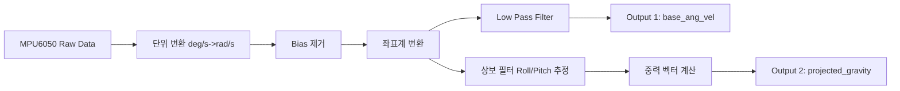

# Sim2Real IMU Integration Technical Report

**Version:** 1.0  
**Date:** 2026-02-06  
**Target System:** SpotMicro (Jetson Orin Nano + MPU6050)  
**Simulation Environment:** Isaac Lab (50Hz)

---

## 1. 개요 (Introduction)

### 1.1 목적
본 문서는 Sim2Real(Simulation to Real-World) 환경 구축의 핵심 요소인 **IMU(Inertial Measurement Unit) 데이터 통합 방법**을 상세히 기술합니다. Isaac Lab 시뮬레이터에서 학습된 강화학습(RL) 모델이 실제 로봇에서도 동일한 관측값(Observation)을 받아 올바르게 동작하도록 하는 것이 목표입니다.

### 1.2 요구사항
Isaac Lab의 표준 보행 정책(Locomotion Policy)은 다음과 같은 IMU 관련 입력을 요구합니다. (총 84차원 Observation 중 6차원)

| 관측 변수명 | 차원 | 단위 | 좌표계 | 설명 |
|---|---|---|---|---|
| `base_ang_vel` | 3 | rad/s | Base Frame | 로봇 몸체의 회전 각속도 (Roll/Pitch/Yaw Rate) |
| `projected_gravity` | 3 | 정규화 벡터 | Base Frame | 로봇 몸체 기준 중력 방향 벡터 ($g$) |

---

## 2. 하드웨어 설정 및 보정 (Hardware Setup)

### 2.1 I2C 연결 확인
MPU6050 센서는 Jetson의 I2C 버스에 연결됩니다. 주소는 일반적으로 `0x68`입니다.

```bash
sudo i2cdetect -y 1
# 68이 표출되어야 함
```

### 2.2 Gyroscope Bias Calibration
저렴한 MEMS 자이로스코프는 온도와 제조 공정에 따라 **초기 바이어스(Offset)**가 존재합니다. 이를 제거하지 않으면 적분 오차가 빠르게 누적됩니다.

- **절차**:
  1. 로봇을 평평한 바닥에 두고 **완전히 정지**시킵니다.
  2. 수 초간 자이로 데이터를 수집하여 평균값을 계산합니다.
  3. 이후 측정되는 모든 값에서 이 평균값을 뺍니다.

$$ \omega_{corrected} = \omega_{raw} - \omega_{bias} $$

---

## 3. 좌표계 정의 및 변환 (Coordinate Systems)

Sim2Real의 가장 중요한 단계는 시뮬레이션과 실제 센서의 좌표축을 일치시키는 것입니다.

### 3.1 좌표계 비교

| 시스템 | X축 (Forward) | Y축 (Left) | Z축 (Up) | 비고 |
|---|---|---|---|---|
| **Isaac Lab** | 로봇 전방 | 로봇 좌측 | 로봇 상방 | **ENU / Right-Handed** |
| **MPU6050** | PCB 인쇄 기준 | PCB 인쇄 기준 | PCB 인쇄 기준 | **장착 방향에 따라 상이함** |

### 3.2 일반화된 매핑 법칙 (3-Step Alignment Rule)

어떤 방향으로 센서를 장착하더라도 다음 규칙으로 좌표계를 일치시킬 수 있습니다.

1.  **Z축 매핑 (중력 테스트)**:
    - 로봇을 평지에 둡니다.
    - 가속도 센서 값 중 **-9.8 (또는 -1g)**이 나오는 축을 찾습니다.
    - 그 축이 시뮬레이터의 **-Z축**에 해당합니다. (예: Accel Y가 -9.8이면, $Z_{sim} = Y_{sensor}$)

2.  **X축 매핑 (가속 테스트)**:
    - 로봇을 앞으로 확 밉니다 (전진 가속).
    - 가속도 센서 값 중 **양수(+)**가 튀는 축을 찾습니다.
    - 그 축이 시뮬레이터의 **X축**에 해당합니다. (예: Accel X가 양수이면, $X_{sim} = X_{sensor}$)

3.  **Y축 매핑 (오른손 법칙)**:
    - $Z_{sim}$과 $X_{sim}$이 결정되면, 오른손 법칙($X \times Y = Z$)에 따라 $Y_{sim}$은 자동으로 결정됩니다.

### 3.3 구현 예시 (Transform Implementation)

만약 MPU6050이 칩의 Y축이 로봇의 전방을 향하고, Z축이 하늘을 향하도록 장착되었다면:

```python
def transform_to_isaac_frame(raw_x, raw_y, raw_z):
    # Sensor Y -> Sim X (Front)
    # Sensor -X -> Sim Y (Left)
    # Sensor Z -> Sim Z (Up)
    sim_x = raw_y
    sim_y = -raw_x
    sim_z = raw_z
    return sim_x, sim_y, sim_z
```

---

## 4. 데이터 처리 알고리즘 (Algorithm)

### 4.1 전체 파이프라인



### 4.2 단위 변환
MPU6050 라이브러리는 보통 `deg/s` (자이로)와 `m/s²` (가속도)를 반환합니다. Isaac Lab은 `rad/s`를 사용하므로 변환이 필수입니다.

```python
gyro_rad_s = math.radians(gyro_deg_s)
```

### 4.3 상보 필터 (Complementary Filter)
`projected_gravity`를 계산하려면 로봇의 절대적인 자세(Roll, Pitch)를 알아야 합니다.
- **가속도(Accel)**: 정지 시 중력 방향을 통해 절대 기울기를 알 수 있으나, 진동에 취약합니다.
- **자이로(Gyro)**: 빠르게 변하는 각도를 정확히 측정하나, 적분할수록 드리프트가 발생합니다.

두 센서를 융합하여 장점만 취합니다:

$$ \theta_{new} = \alpha \cdot (\theta_{old} + \omega \cdot dt) + (1-\alpha) \cdot \theta_{accel} $$

- $\alpha$ (Alpha): 보통 0.98 사용 (자이로 신뢰도)
- $dt$: 제어 주기 (0.02s for 50Hz)

---

## 5. Projected Gravity 상세 구현

이 부분은 Isaac Lab의 내부 구현과 수학적으로 동일해야 합니다.

### 5.1 수학적 정의
**Projected Gravity**는 월드 좌표계의 중력 벡터 $\vec{g}_W = [0, 0, -1]^T$를 로봇의 회전 행렬 $R$의 역행렬 $R^T$를 통해 바디 좌표계로 회전시킨 것입니다.

$$ \vec{g}_{body} = R^T \cdot \vec{g}_W $$

이를 Roll($\phi$), Pitch($\theta$)로 풀면 다음과 같습니다:

$$
\vec{g}_{body} = \begin{bmatrix}
-\sin(\theta) \\
\sin(\phi)\cos(\theta) \\
-\cos(\phi)\cos(\theta)
\end{bmatrix}
$$

### 5.2 Python Processor Class 코드

```python
import math
import numpy as np
import time

class IMUProcessor:
    """
    MPU6050 데이터를 처리하여 RL 모델용 observation을 생성하는 클래스.
    - Gyro Bias Calibration 제공
    - Coordinate Transformation 제공
    - Complementary Filter를 통한 자세 추정
    - Projected Gravity 계산
    """
    
    def __init__(self, dt=0.03, alpha=0.98):
        self.dt = dt
        self.alpha = alpha
        
        # State variables
        self.roll = 0.0   # rad
        self.pitch = 0.0  # rad
        self.gyro_bias = np.zeros(3)
        self.initialized = False
        
    def calibrate_gyro_bias(self, imu, samples=200):
        print("Calibrating Gyro... DO NOT MOVE ROBOT.")
        bias_sum = np.zeros(3)
        for _ in range(samples):
            data = imu.get_gyro_data()
            bias_sum += np.array([data['x'], data['y'], data['z']])
            time.sleep(0.01)
        self.gyro_bias = bias_sum / samples
        print(f"Calibration Complete. Bias: {self.gyro_bias}")
        
    def _transform_frame(self, x, y, z):
        """
        [USER TODO] 센서 장착 방향에 따라 이 부분을 수정하세요.
        목표: Isaac Lab Frame (X:Front, Y:Left, Z:Up)
        """
        # Case: IMU Flipped (Z down)
        sim_x = x
        sim_y = -y
        sim_z = -z
        return sim_x, sim_y, sim_z
    
    def process(self, accel_raw, gyro_raw):
        # 1. BIAS CORRECTION
        gx = gyro_raw['x'] - self.gyro_bias[0]
        gy = gyro_raw['y'] - self.gyro_bias[1]
        gz = gyro_raw['z'] - self.gyro_bias[2]
        
        # 2. COORDINATE TRANSFORM
        sim_gx, sim_gy, sim_gz = self._transform_frame(gx, gy, gz)
        sim_ax, sim_ay, sim_az = self._transform_frame(accel_raw['x'], accel_raw['y'], accel_raw['z'])
        
        # 3. UNIT CONVERSION (deg/s -> rad/s)
        base_ang_vel = np.array([math.radians(sim_gx), math.radians(sim_gy), math.radians(sim_gz)], dtype=np.float32)
        
        # 4. COMPLEMENTARY FILTER
        # Calculate Accel Angles (rad)
        accel_roll = math.atan2(sim_ay, sim_az)
        accel_pitch = math.atan2(-sim_ax, math.sqrt(sim_ay**2 + sim_az**2))
        
        if not self.initialized:
            self.roll = accel_roll
            self.pitch = accel_pitch
            self.initialized = True
        else:
            # Update Roll
            self.roll = self.alpha * (self.roll + base_ang_vel[0] * self.dt) + \
                        (1 - self.alpha) * accel_roll
            # Update Pitch
            self.pitch = self.alpha * (self.pitch + base_ang_vel[1] * self.dt) + \
                         (1 - self.alpha) * accel_pitch
                         
        # 5. COMPUTE PROJECTED GRAVITY
        # Formula: R_inv * [0, 0, -1]
        pg_x = -math.sin(self.pitch)
        pg_y = math.sin(self.roll) * math.cos(self.pitch)
        pg_z = -math.cos(self.roll) * math.cos(self.pitch)
        
        return base_ang_vel, np.array([pg_x, pg_y, pg_z], dtype=np.float32)
```

---

## 6. 검증 (Verification)

### 6.1 예상 출력값 표 (Truth Table)

센서 데이터를 로깅하며 아래 동작을 수행했을 때, `projected_gravity` 값이 표와 일치해야 합니다.

| 로봇 동작 | Roll | Pitch | 예상 Projected Gravity Vector | 검증 포인트 |
|---|---|---|---|---|
| **평지 정지** | 0° | 0° | `[ 0.0,  0.0, -1.0]` | Z축이 -1에 가까운가? |
| **앞을 듦 (Nose Up)** | 0° | +90° | `[-1.0,  0.0,  0.0]` | X축이 -1로 변하는가? |
| **뒤를 듦 (Nose Down)** | 0° | -90° | `[ 1.0,  0.0,  0.0]` | X축이 +1로 변하는가? |
| **왼쪽을 듦 (Roll Right)** | -90° | 0° | `[ 0.0, -1.0,  0.0]` | Y축이 -1로 변하는가? |

> **주의**: Roll 방향 부호는 정의하기 나름일 수 있으므로, **오른손 법칙**에 따라 X축(전방) 기준으로 시계/반시계 회전을 체크해야 합니다. Isaac Lab에서 +Roll은 **우측으로 회전**(= 로봇 왼쪽 다리가 들림)입니다.

---

## 7. 체크리스트 (Checklist)

구현 후 다음 항목들을 반드시 확인하세요.

- [ ] **I2C 연결**: `i2cdetect` 명령어로 센서 인식 확인.
- [ ] **캘리브레이션 루틴**: 로봇 구동 초기에 3초간 정지하여 Gyro Bias를 잡는지 확인.
- [ ] **좌표계 방향**: 로봇을 앞/뒤/좌/우로 기울이며 `base_ang_vel`과 `projected_gravity`의 부호가 맞는지 확인.
- [ ] **단위 확인**: Gyro 값이 `deg/s`가 아닌 `rad/s`로 모델에 들어가는지 재확인.
- [ ] **Loop Rate**: 제어 루프가 50Hz(0.02s)를 일정하게 유지하는지 확인 (`time.time()`으로 주기 측정).
